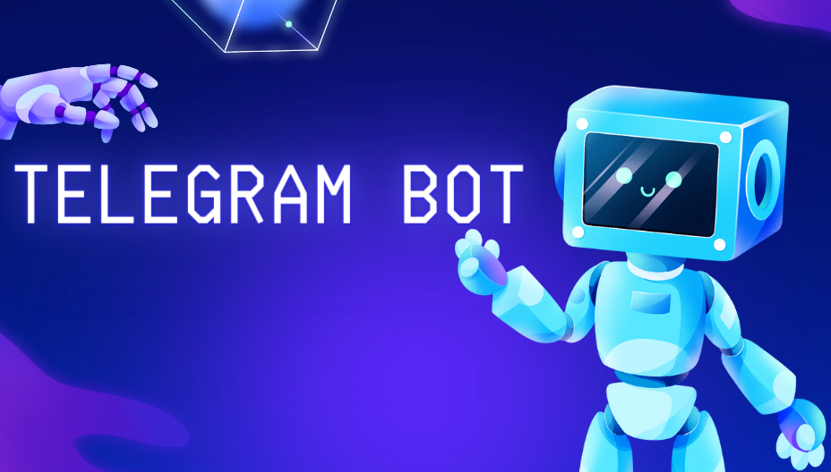

  
  <h2 align="center">🤖Telegram Bot🤖</h2>

Тут ви можете використовувати телеграм бота в якості помічника з дистанційного керування комп'ютором. Для цього достатньо зайти в телеграм(з телефону, наприклад), написати, що вам потрібно(типу відкрий ютуб музику) і він це зробить, поки ви йдете до своєї кімнати.

# Інсталяція
1. Клонуйте репозиторій: `git clone https://github.com/kulidaden/Voic.git`
2. Зайдіть в папку 'Voic' ( `cd Voic` ) -> `pip install -r requirements.txt`
Потрібно зайти в телеграм, та знайти чат з @BotFather та написати наступно команди: /newbot -> (даєте назву боту) -> (даєте другу назву боз з закінчкнням _bot) -> берете з повідомлення ключ(наприклад: 7256435231:AAG3vTo73s6fx3TbQlHHMgCXwFtnj22OlZs).
Тепер цей ключ треба вставити в базу даних test(база даних),tg_bot(таблиця),bot_token(колонка), запишіть дані(збережіть). Щоб зайти в базу даних, перебуваючи у файлі 'Voic', напишіть команду -> `cd DataBase_V` та відкрийте базу даних test. Писля виконаної операції, запустіть файл osnova.py.
   
## Використання
Після запуску вам прийде повідомлення від бота, що ви його не шукали. Тепер ви можете йому писати свої команди.

## Контакт
Якщо Вам потрібна консультація або допомога по використанні програми: Telegram: @DeLemse

# Name and description of the project
## Telegram_Bot
Here you can use the Telegram bot as an assistant for remote computer control.  To do this, it is enough to go to Telegram, write what you need (like open YouTube music) and he will do it while you go to your room.

# Installation
1. Clone the repository: `git clone https://github.com/kulidaden/Voic.git`
2. Go to the 'Voic' folder ( `cd Voic` ) -> `pip install -r requirements.txt`
You need to go to Telegram, find a chat with @BotFather and write the following commands: /newbot -> (give the name of the bot) -> (give the second bot name ending with _bot) -> take the key from the message (for example: 7256435231:AAG3vTo73s6fx3TbQlHHMgCXwFtnj22OlZs).
Now this key must be inserted into the test database (database), tg_bot (table), bot_token (column), write down the data (save).  To access the database, while in the 'Voic' file, write the command -> `cd DataBase_V` and open the test database.  After the completed operation, run the osvana.py file.
   
## Usage
After starting, you will receive a message from the bot that you did not search for it.  Now you can write your commands to it.

## Contact
If you need advice or help using the program: Telegram: @DeLemse
